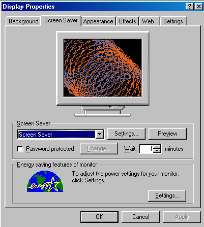



## Screen Saver with \*\*Demo\*\* \(in Display Properties Dialog\)

### Description

This is a Screen Saver whose thumbnail appears in the Display Settings' Monitor (See the Screen Shot). First time in PSC!!

Please Vote/Comment on this code. Thanks.
 
### More Info
 

             |
---                |---
**Submitted On**   |2001-08-21 11:09:52
**By**             |[Hesan Feghhi](https://github.com/Planet-Source-Code/PSCIndex/blob/master/ByAuthor/hesan-feghhi.md)
**Level**          |Intermediate
**User Rating**    |4.6 (23 globes from 5 users)
**Compatibility**  |VB 5\.0, VB 6\.0
**Category**       |[Windows API Call/ Explanation](https://github.com/Planet-Source-Code/PSCIndex/blob/master/ByCategory/windows-api-call-explanation__1-39.md)
**World**          |[Visual Basic](https://github.com/Planet-Source-Code/PSCIndex/blob/master/ByWorld/visual-basic.md)
**Archive File**   |[Screen Sav250308212001\.zip](https://github.com/Planet-Source-Code/hesan-feghhi-screen-saver-with-demo-in-display-properties-dialog__1-26433/archive/master.zip)

